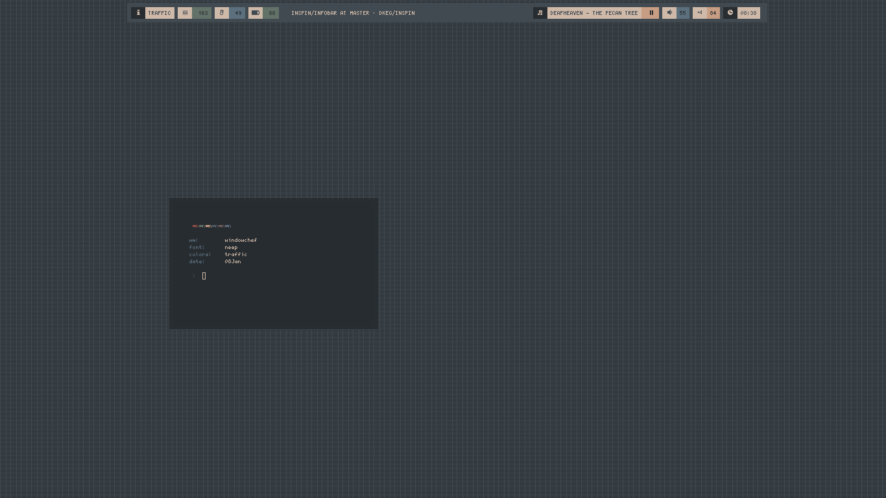

###### inspin
Collections of ideas that finally came to frution. I hope they offer as much inspiration as others works has for me
Find me on linuxbbq

- infobar - system status bar with different outputs based on current wm (current inclusion; xwait (wmutils), windowchef, herbstluftwm, 2bwm, bspwm). 
            Options set for both long and short geometries. Flexible to adjust to suit your needs.
            Color output based on set system status limits (memory, temperature, battery, music (cmus) [play,pause,stop], volume (speaker or headphones, wifi)
            The short geometry may have runoff with 'windowname'. I have not yet set a truncated output.
- morphr - update border/wm colors to match current xrdb. Works with dwm, 2wm, 2bwm. Script will read current wm and apply accordingly. 
- sup - simple menu driven scrot and upload to imgur tool
- promptd - battery state/level driven prompt colors
- wallview - takes current wall(s) - displays as thumbnail 
- poptat - on demand status bar using lemonbar
- ministat - minified popstat (mem,vol,batt,temp,wifi)
- 2bwmColor - update 2bwm border color based on current xcolors. Change border colors, reload with xdotool (also see morphr)
              Morphr is more flexible as it doesn't rely on external scripts. 
- colr - xrdb color and font scraper
- gtkColor - update a base gtk-2 theme from xrdb 
- colrup - run from .xinitrc. Sets wall, gtk colors according to color file
- notifs - spawn notifications from .xinitrc - ministat,time,batt (when discharging)
- pops - variety of popup notification using bar
  * popconf - central command for all popup notification geometry's and color
  * battnotif - battery notifications when below [n] level
  * popper - popup notification for events (cmus, irc, battery, ...)

###### infobar - long geometry option 

###### infobar - short geometry option  

